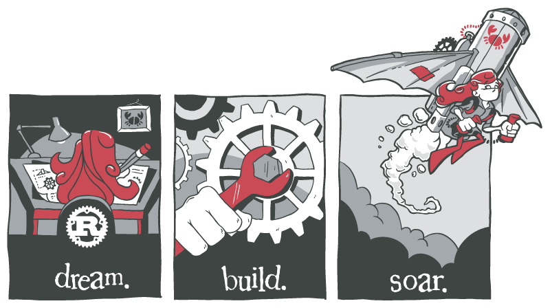

<div align="center">
  <h1>🦀 Rust Learning</h1>
</div>


<p align="center">
  
</p>


<br>

## About This Repo  
The Repo contains small immature programs , some exercise ,and notes from my Rust learning Journey.


## Contents  
- Basic Rust Programs
- Practice exercises 


## Notes  
I created this repository primarily for learning and experimentation.
The code may be simple, incomplete, or changes frequently as i explore Rust.


## Resources  
- [The Rust Programming Language](https://doc.rust-lang.org/book/)
- [Rustlings](https://github.com/rust-lang/rustlings/)
- Other Rust Docs


## Credits  
Rust Lucy artwork © Rust Project.
Source: [rust-artwork](https://github.com/rust-lang/rust-artwork)   
License: [CC BY-NC-ND 4.0](https://creativecommons.org/licenses/by-nc-nd/4.0/)  
Modified the original Rust Lucy artwork by resizing and centering for display in README  


If I've made any mistakes in the code, structure, or explanations, I sincerely apologize. I'm trying to improve. Guidance and Feedback is always Welcome  

```rust
fn main(){
     println!(" Guide your Little brother 🦀🦀 ");
}
```