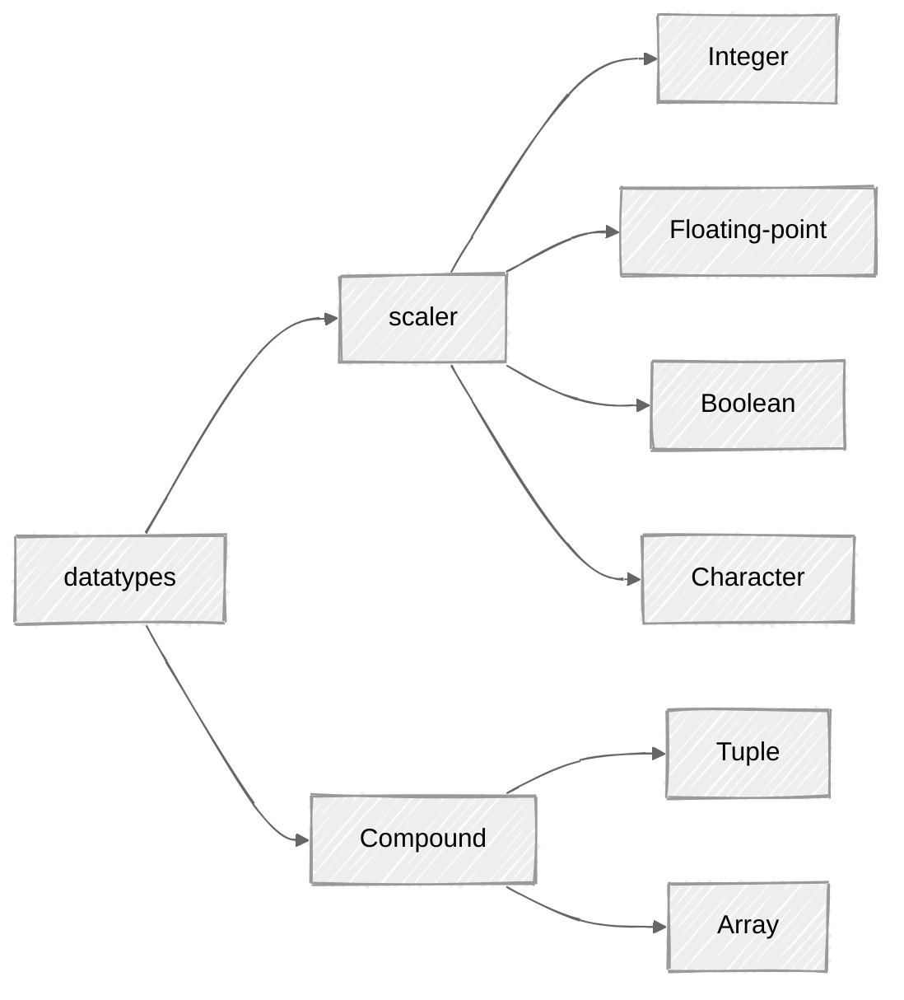

# DATATYPES


# Scaler   
## Integer  

| Length                 | Signed  | Unsigned |
| ---------------------- | ------- | -------- |
| 8-bit                  | `i8`    | `u8`     |
| 16-bit                 | `i16`   | `u16`    |
| 32-bit                 | `i32`   | `u32`    |
| 64-bit                 | `i64`   | `u64`    |
| 128-bit                | `i128`  | `u128`   |
| Architecture-dependent | `isize` | `usize`  |

each variant can be either signed(i) or unsigned(u) and has an explicit size . signed and unsigned refer to whether it's possible for the number to be negative. 

- Each `Signed` Variant can `store` numbers from  $-(2^{n-1})$ to $2^{n-1} -1$ inclusive , where n is the number of bits that variant uses . so , i8 can store numbers from $-(2^7)$ to $2^7 -1$ , which equals to -128 to 127. `Unsighned` Variant can `store` numbers from 0 to $2^n -1$  , so a u8 can store numbers from 0 to $2^8 -1$, which equals 0 to 255. 

- The `isize` and `usize` types depends on the architecture of the computer your program is running on: 64 bits if you’re on a 64-bit architecture and 32 bits if you’re on a 32-bit architecture.

- Note that number literals that can be multiple numeric types allow a type suffix, such as `57u8`, to designate the type.
```rust
let a = 57; // Usually becomes i32 (Rust's default for unsuffixed integers) 
let b: u8 = 57; // You tell the type separately (also fine) 
let c = 57u8; // You force u8 directly in the literal (very clean & explicit)
```


- Number literals can also use `_` as a visual separator to make the number easier to read, such as `1_000`, which will have the same value as if you had specified `1000`.
 
| Number literals  |    Example    |
| :--------------: | :-----------: |
|     Decimal      |   `98_222`    |
|       Hex        |    `0xff`     |
|      Octal       |    `0o77`     |
|      Binary      | `0b1111_0000` |
| Byte (`u8` only) |    `b'A'`     |

- Integer types default to `i32` .

## Floating-Point Types 

Rust’s floating-point types are `f32` and `f64`, which are 32 bits and 64 bits in size, respectively. The default type is `f64` because on modern CPUs, it’s roughly the same speed as `f32` but is capable of more precision. All floating-point types are signed.

```rust
fn main() {
        let x = 2.0; // f64 
        let y: f32 = 3.0; // f32 
}
```
## Boolean Type

Boolean Type have two Possible values : `true` and `false` .
Booleans are `One Byte` in size .
The Boolean Type on Rust is specified using `bool` .

```rust
fn main() {
        let t = true; 
        let f: bool = false; // with explicit type annotation
}
```

## The Character Type

Rust’s `char` type is the language’s most primitive alphabetic type.

```rust
fn main() {
    let c = 'z';
    let z: char = 'Z'; //with explicit type annotation
    let heart_eyes_cat = '😻';
}
```

>[!Note]- some-points
 -->we specify `char` literals with single quotation marks, as opposed to string literals, which use double quotation marks.
  -->Rust’s `char` type is 4 bytes in size and represents a Unicode scalar value, which means it can represent a lot more than just ASCII.
  --> Accented letters; Chinese, Japanese, and Korean characters; emojis; and zero-width spaces are all valid `char` values in Rust.
> -->Unicode scalar values range from `U+0000` to `U+D7FF` and `U+E000` to `U+10FFFF`   inclusive. 

# Compound Types

## Tuple
- Tuple is a general way of grouping together a number of values with variety of types into one compound 

>[!Question]- can tuple grow and shrink in size once declared ?
>NO , tuple have fixed length

>[!Question]- how to create a tuple ?
> ```rust
>  fn main () { 
>   let tup: (i32,f64) = (500,6.4); /* here added optional type 
>   annotations */ 
>   }
> ```
>   `,` separted list of values inside a `()` , each position has a type , and each position can hold different types. ( they don't have to ber same)

- `tup` binds to the entire tuple because it is considered a single compound element.

>[!question]- How to access value of tuple and desturcture it ?
> -> pattern matching method to destructure , to get individual value 
> ```rust
> fn main() { 
>      let tup = (500,3.4,1);
>      let (x,y,z) = tup;
>      println!("the value of y is: {y} ");
> }
> ```
> OR we can also use ` <tuple>.<index>` to access
> ```rust
> fn main() {
>        let x = (500,2.3,4);
>        let four = x.2 ;
> }
> ```
## Array
>[!Question]- how to create array and can it grow and what about types?
>```rust
>fn main() {
>      let a = [1,2,3,4,5];
>}
>```
> - array have fixed length 
> - every element must have a same type

>[!tip]- when is array useful?
> - array useful when data allocated on the stack
> - or when want to ensure that always have a fixed no. of elements

>[!example]- more ways to initilize array
>```rust
>fn main() {
>      let a:[i32;5] = [1,2,3,4,5];
>      // here i32->type , 5-> no. of element
>      let b = [3;5];
>      //it will contain 5 ele array that will all set to 3 
>      //same like writing `let b = [3,3,3,3,3];`
>      //but in more concise way
>      
>}
>```

>[!question]- how to access array element?
> we can access like this : < array >.[index]
> ```rust
> fn main() {
>      let a = [1,2,3,4,5];
>      let first = a.[0];
> }
> ```

>[!example]- invalid array element access
>```rust
>use std::io;
>fn main() {
>     let a = [1,2,3,4,5];
>      println!("enter an array index");
>      let mut index = String::new();
>      io::stdin().read_line(&mut index).expect("failed to read line");
>      let index: usize = index.trim().parse().expect("index entered was not a number);
>      let element = a[index];
>      println!("The value of ele at index {index} is: {element}");
>}
>```
> >[!error]- this code will return error
> >```bash
> >thread 'main' panicked at src/main.rs:19:19:
> >index out of bounds: the len is 5 but the index is 10
> >note: run with `RUST_BACKTRACE=1` environment variable to display a backtrace
> >```
> 
>>[!success]- concept behind it
> >>`example of rust memory safety`
> >>firsty rust will check length of array 
> >>like , index <= len array 
> >>after than it will read array
>
>```mermaid
>---
>config:
>    look: handDrawn
>    theme: neutral
>---
>flowchart TD
>      Index[user index] --> check{Index < length?}
>      check -- NO --> Panic[Panic & stop]
>      check -- YES --> Access[Read Memory Address]
>
>      style Panic fill:#f38ba8,color:#1b1b29
>      style Access fill:#a6e3a1,color:#1b1b29
>```
>