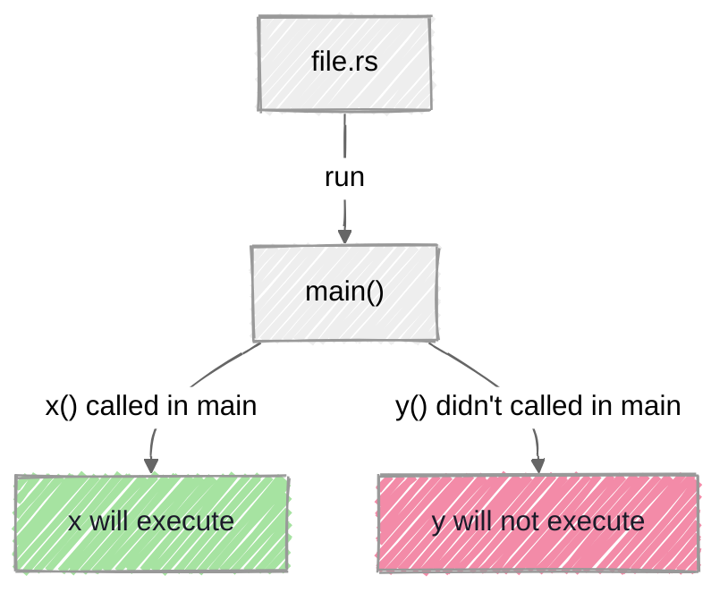

>[!question]- how function get called ?
> ```rust 
> fn another_fn(){
>      println!("hello);
> }
> fn main() {
>       println!("world");
>      another_fn();
> }
> ```
>
>>[!success]- its output will be
>>```bash
>>world
>>hello
>>```
>>as rust doesn't care which fn u define first, it execute them in which sequence u call them inside the main(), if fun() didn't get called inside main() then it will not get execute, 

>[!note]- parameteres
>we can pass parameters in fn body to 
>```rust
>fn main() {
>       print_measurements(5,'h');
>}
>fn print_measurements(value: i32,unit: char){
>       println!("the measurments is : {value}{unit}");
>}
>```
> - must define each parameters type in fn signatures
> - and pass the parameters while calling fn in main() body

| Statements                                                       | Expressions                                                                               |
| ---------------------------------------------------------------- | ----------------------------------------------------------------------------------------- |
| instructions that perform some action and do not return a value. | Expressions evaluate to a resultant value.                                                |
| do not return value                                              | return value                                                                              |
| let x = 22; is an statment                                       | x +1  (at the end didn't put `;` made it an expression)                                   |
| doing let x = (let y = 6); will give an error                    | doing let y = { <br>          let x = 3;<br>		  x+1<br>} will return output without error |


>[!question]- how to define fn with return values ?
>```rust 
>fn five() -> i32 {
>       5 // if we write 5; it will give an error
>}
>fn main() { 
>      let a = five(); // here five() will return value 5
>      let b = plus_one(5); 
>}
>fn plus_one(b:i32) -> i32 {
>       b+1
>}
>```
>>[!bug]- if we write b+1; than it will return in error like this
>> ```bash
>> error[E0308]: mismatched types
>> --> src\bin\file.rs:62:23
>>   |
>>   | fn plus_one(b:i32) -> i32 {
>>   |    --------           ^^^ expected `i32` , found `()`
>>   |    |           
>>   |implicitly returns `()` as its body has no tails or `return` expression
>>   |   b+1;
>>   |     -help: remove this semicolon to return this value 
>> ```


